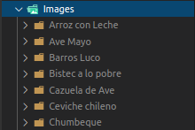

# Eliminación de imágenes repetidas

Este código esta destinado a la eliminación de imágenes repetidas o que sean similares en un 10% entre sí. Para calcular este porcentaje se normalizan las imágenes mediante *min max normalization* y luego mediante la distancia de manhattan se calcula la similitud entre dos imágenes.

## Min Max Normalization

La normalización de una entrada $x$ se realiza de la siguiente manera:

$$\Large x_{norm} = \frac{x - min(x)}{max(x) - min(x)}$$

## Consideraciones

Para ejecutar este código se necesitan las siguientes librerías:

- `Opencv`:  [ver](https://pypi.org/project/opencv-python/)
- `Numpy`: [ver](https://numpy.org/doc/stable/user/install.html)

## Instrucciones

Para ejecutar esta herramienta se debe crear un directorio con cualquier nombre (p.ej `Images`) en donde se encuentren las imágenes separadas en _**distintos subdirectorios**_, como se muestra en la figura:

      
    <figcaption>Directorio con las imágenes</figcaption>

 

Una vez con las imágenes cargadas en la raíz del proyecto, abrimos un _terminal_ o _CMD_ para ejecutar el archivo _main.py_ que es el encargado de encontrar duplicados y eliminarlos. El primer paso es ejecutar en la consola el siguiente comando:

        :~$ python main.py

En primera instancia, el programa nos preguntará cual es el directorio en donde están alojadas las imágenes, aquí debemos ingresar nuestro directorio creado en el paso anterior:

- Como consejo, ingresar el directorio con el siguiente formato: `./nombre_carpeta/`, como se ilustra en la siguiente imagen: 

 

 

Posteriormente, se comenzará con la eliminación de las imágenes duplicadas o similares.